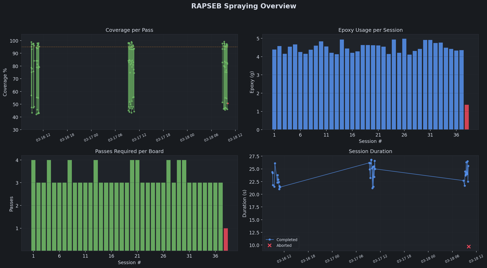
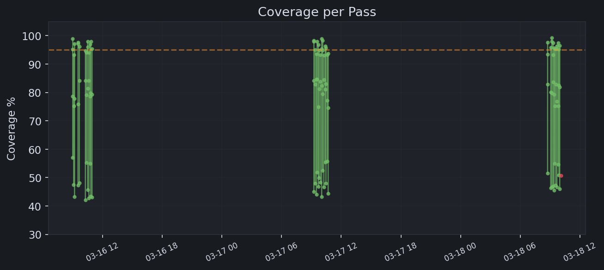

# RAPSEB FIWARE Stack

FIWARE/NGSI-LD integration for the RAPSEB epoxy spraying workcell. Captures per-pass and per-session spray data via Orion-LD context broker and visualises it through Grafana dashboards.



## Quick Start

```bash
docker compose up -d
python scripts/generate_demo_data.py
```

Open Grafana at http://localhost:3000 (login: `rapseb` / `arise2026`).

## Services

| Service | Port | Description |
|---------|------|-------------|
| Orion-LD | 1026 | NGSI-LD context broker |
| MongoDB | 27017 | Persistence layer |
| Grafana | 3000 | Dashboard and visualisation |

## NGSI-LD Entities

Two entity types, defined in `ngsi_ld/data_models.py`:

| Entity | Key Properties |
|--------|---------------|
| `SprayPass` | passNumber, coveragePercentage, epoxyUsed, duration |
| `SpraySession` | totalPasses, finalCoveragePercentage, totalEpoxyUsed, status |

## ROS 2 Integration

The `scripts/ros_bridge.py` node subscribes to `/rapseb/spray_status` (std_msgs/String with JSON payload) and pushes entities to Orion-LD. Two event types are handled:

| event_type | Payload Fields | Entity Created |
|------------|---------------|----------------|
| `pass_complete` | pass_id, surface_id, pass_number, coverage_pct, duration_s, epoxy_g | SprayPass |
| `session_complete` | session_id, surface_id, total_passes, target_passes, final_coverage_pct, total_epoxy_g, start_time, end_time, status | SpraySession |

See [Integration with Main Codebase](#integration-with-main-codebase) below for setup instructions.

## Dashboard

Four panels tracking spray performance over time:



| Panel | What it shows |
|-------|--------------|
| Coverage per Pass | Per-pass coverage progression (green = completed, red = aborted) |
| Epoxy Usage per Session | Total epoxy consumed per board |
| Passes per Board | Number of passes required to reach target coverage |
| Session Duration | Time per board, with aborted sessions marked |

## File Layout

```
rapseb-fiware/
  docker-compose.yml          # Orion-LD, MongoDB, Grafana
  scripts/
    generate_demo_data.py     # Demo data generator (CSV + NGSI-LD JSON)
    render_dashboard.py       # Renders dashboard PNGs from CSV data
    orion_client.py           # Orion-LD HTTP client
    ros_bridge.py             # ROS 2 node: /rapseb/spray_status -> Orion-LD
  ngsi_ld/
    data_models.py            # SprayPass and SpraySession entity builders
  config/grafana/
    dashboards/               # Grafana dashboard JSON
    provisioning/             # Datasource and dashboard provisioning
  data/                       # Generated CSV and JSON files
  docs/                       # Dashboard screenshots
```

## Integration with `robotic_arm_spraying_jazzy`

This stack is an optional add-on to `robotic_arm_spraying_jazzy`. It does not affect spraying operation if not running — the bridge node is entirely passive.

### Prerequisites

- Docker and Docker Compose installed on the host machine
- The main spraying workspace (`ros2_ws`) built and sourced
- Network connectivity between the ROS 2 host and the Docker stack (default: `--network=host`)

### Step-by-step

1. Start the FIWARE stack:

```bash
cd rapseb-fiware
docker compose up -d
```

2. Verify Orion-LD is healthy:

```bash
curl http://localhost:1026/version
```

3. In a new terminal inside your Vulcanexus container, run the bridge node:

```bash
source /opt/ros/jazzy/setup.bash
source /ros2_ws/install/setup.bash
python3 /path/to/rapseb-fiware/scripts/ros_bridge.py
```

Or with a remote Orion-LD host:

```bash
python3 /path/to/rapseb-fiware/scripts/ros_bridge.py \
  --ros-args -p orion_host:=192.168.1.100 -p orion_port:=1026
```

4. The bridge listens on `/rapseb/spray_status`. Once the spraying nodes publish pass/session events to this topic, data flows automatically to Orion-LD and appears in Grafana.

### Required changes in `robotic_arm_spraying_jazzy`

The single integration point is a publisher on `/rapseb/spray_status` (`std_msgs/String`, JSON). Two events need to be emitted from the main codebase:

**`pass_complete`** — publish at the end of each spray pass (e.g. from the spray execution controller, after coverage feedback is received):

```python
import json
from std_msgs.msg import String

# In the spray controller node __init__:
self._fiware_pub = self.create_publisher(String, '/rapseb/spray_status', 10)

# After a pass completes and coverage is computed:
msg = String()
msg.data = json.dumps({
    "event_type": "pass_complete",
    "pass_id": "pass-00001",          # unique per pass
    "surface_id": "board-001",        # board/workpiece identifier
    "pass_number": 1,                 # 1-indexed within session
    "coverage_pct": 54.2,             # coverage after this pass
    "duration_s": 7.3,                # pass duration in seconds
    "epoxy_g": 1.42,                  # epoxy dispensed in grams
    "timestamp": "2026-03-16T09:00:03+00:00"
})
self._fiware_pub.publish(msg)
```

**`session_complete`** — publish when a board session ends (e.g. from the session manager node, on target coverage reached or abort):

```python
msg = String()
msg.data = json.dumps({
    "event_type": "session_complete",
    "session_id": "session-001",
    "surface_id": "board-001",
    "total_passes": 4,
    "target_passes": 6,
    "final_coverage_pct": 98.1,
    "total_epoxy_g": 6.8,
    "start_time": "2026-03-16T09:00:00+00:00",
    "end_time":   "2026-03-16T09:01:45+00:00",
    "status": "completed"             # or "aborted"
})
self._fiware_pub.publish(msg)
```

No additional dependencies are required in `robotic_arm_spraying_jazzy` beyond `std_msgs`. The FIWARE stack and bridge can be stopped at any time without impacting spraying operation.

### Demo Data Without ROS 2

To populate the dashboard with sample data for demonstration or review:

```bash
python scripts/generate_demo_data.py
python scripts/render_dashboard.py
```

This generates 38 spraying sessions across 3 days with realistic coverage progression and timing.

## Maintainer

Parity Platform P.C.
